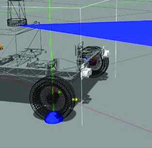
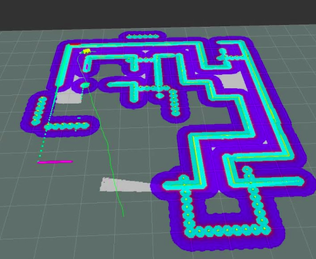

# IEEE ROSCore
Competition: [ROSCore](https://unstop.com/competitions/roscore-by-robotrek-techtatva-2020-manipal-institute-of-technology-mit-manipal-132427)  
Media: [The MIT Post](https://themitpost.com/techtatva20%E2%81%A0-robotrek/)  
Outcome: First Prize

Baymax is a mobile robot that was made in 5 hours (4 hours and 37 minutes to be precise). It went on to win ROSCore, a national level competition which involved designing the robot with capabilities of navigating, localising and planning its way through a maze while also parallely performing vision based tasks (scanning AR codes and storing them as reference points).

 
 
Baymax

 
 
Maze

## Team
- [Gokul P.](https://www.linkedin.com/in/gokulp01/)
- [Arpit C.](https://www.linkedin.com/in/arpitchauhan100/)
- [Shreesh T.](https://www.linkedin.com/in/xshreesh/)
